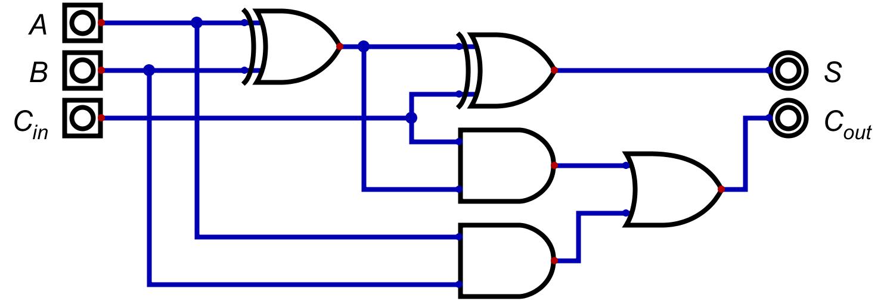
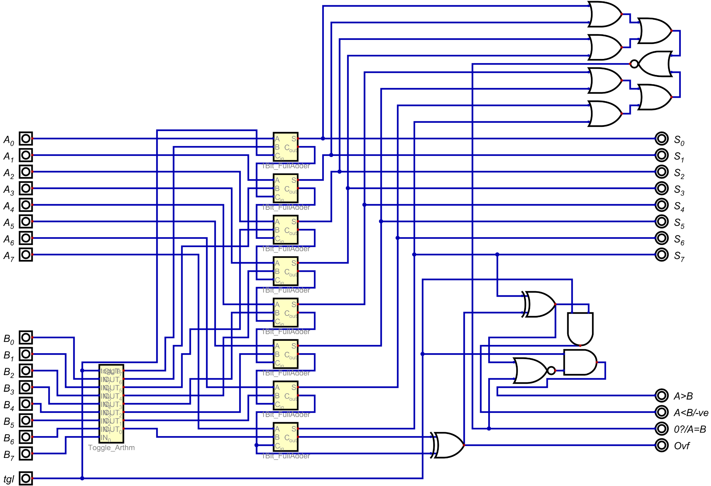
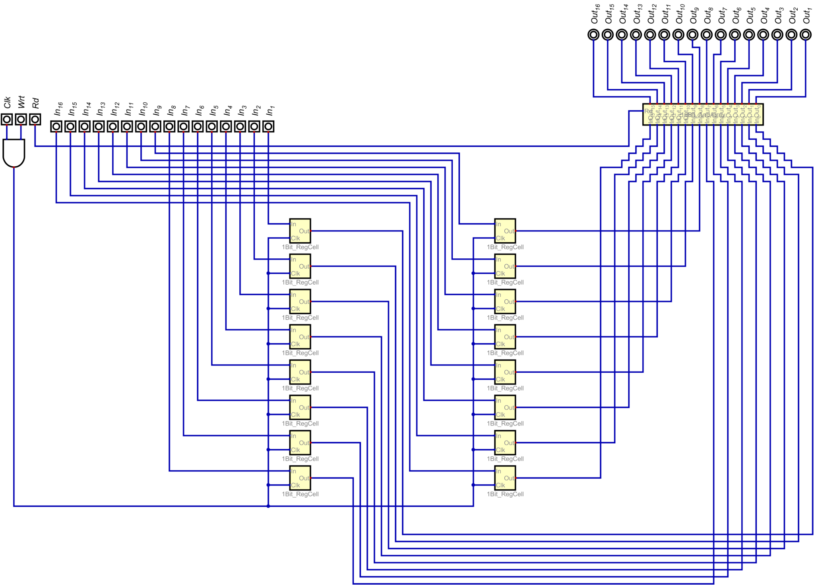
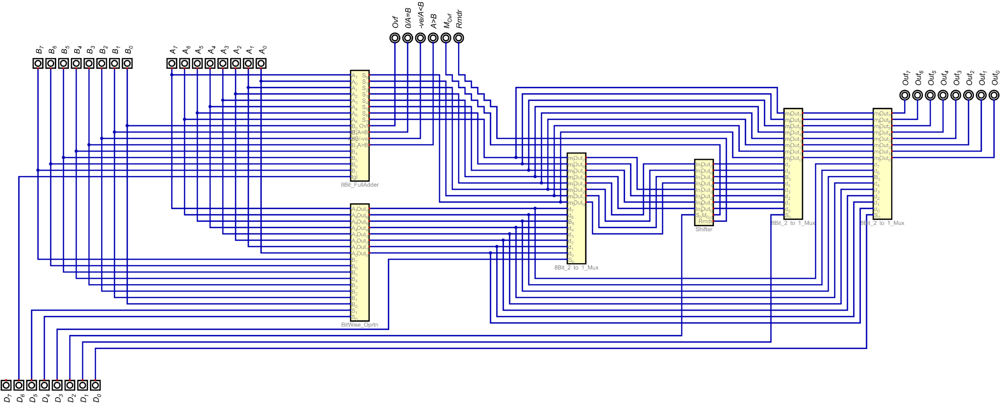
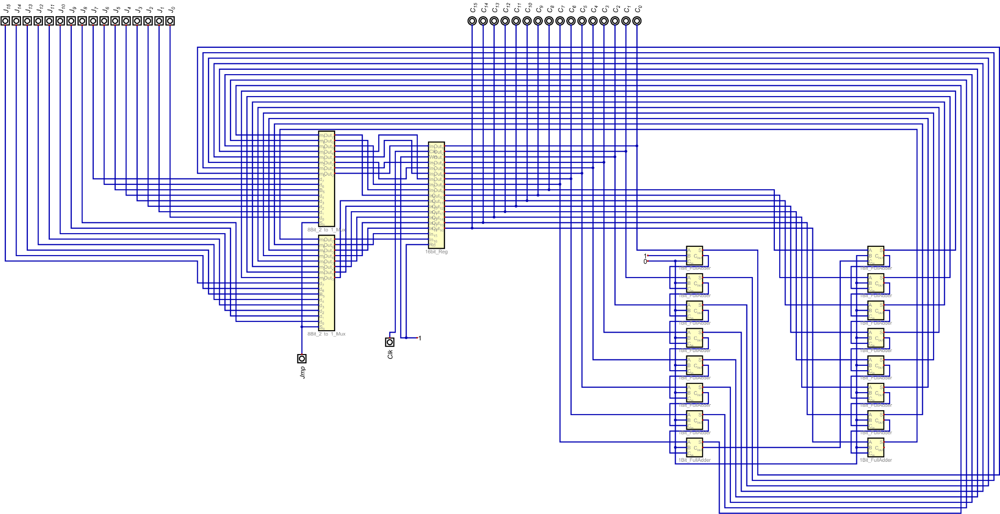
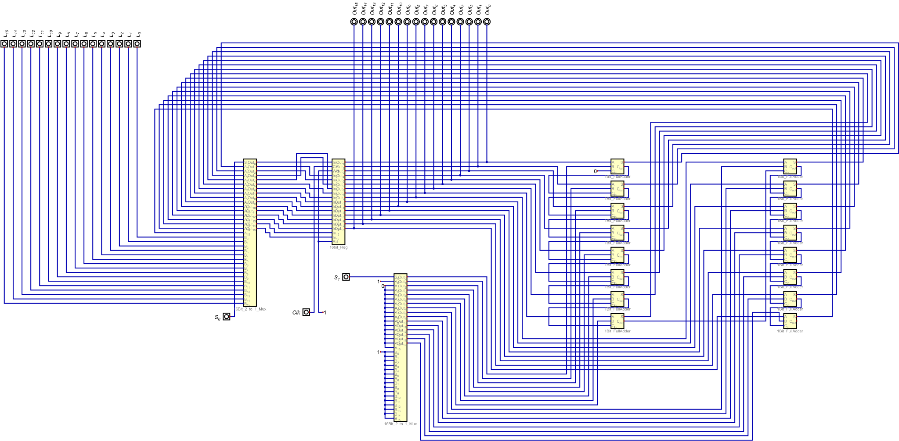

# Custom 8-bit CPU

An archived digital-logic and VHDL project exploring the ground-up design of a custom 8-bit CPU.

This project was originally developed as a hands-on exercise in digital logic, computer architecture, and VHDL. The CPU was designed hierarchically in **Digital by H. Neemann**, beginning with basic logic blocks and progressively combining them into larger CPU components.

The project reached approximately **70% completion** before development was discontinued. This repository preserves the implemented portion of the design, including the original Digital schematics, corresponding VHDL modules, and schematic renders.

> **Status:** Archived — approximately 70% complete  
> **Original development:** 2026  
> **Current purpose:** Preservation of the original design and development work

---

## Architecture

The CPU was intended to use a custom architecture with:

- **8-bit data path**
- **24-bit address bus**
- **Up to 16 MB addressable memory**
- **~2 MHz target clock**
- **Custom instruction set architecture**

The design was built from smaller reusable digital components rather than starting from a pre-existing processor core.

---

## Implemented Logic

The archived design contains the following modules:

### Fundamental Components

- 1-bit Full Adder
- 1-bit Register Cell
- 2-to-1 Multiplexer
- 4-to-1 Multiplexer

### Multi-bit Components

- 8-bit 2-to-1 Multiplexer
- 8-bit 4-to-1 Multiplexer
- 8-bit Full Adder
- 16-bit 2-to-1 Multiplexer
- 16-bit AND Array
- 16-bit Register

### CPU Components

- Arithmetic Logic Unit (ALU)
- Bitwise Operation Unit
- Shifter
- Program Counter
- Stack Pointer
- Arithmetic Toggle Logic

Each module is preserved both as a **Digital schematic (`.dig`)** and as its corresponding **VHDL implementation (`.vhdl`)**.

---

## Design Progression

The project was developed hierarchically, starting from elementary logic and gradually building larger datapath components.

### 1-bit Full Adder

The full adder formed one of the fundamental arithmetic building blocks used later in the wider arithmetic circuitry.

### 8-bit Full Adder

Individual arithmetic blocks were combined to construct an 8-bit datapath.

### 16-bit Register

Register cells were expanded into larger storage structures for use within the processor architecture.

### Arithmetic Logic Unit

The ALU integrates the arithmetic, bitwise, shifting, and selection logic developed throughout the project.

### Program Counter

The program counter was one of the larger CPU-level components completed before the project was archived.

### Stack Pointer

The stack pointer represents another completed processor-level component preserved in the repository.

---

## Repository Structure

    8Bit_CPU/
    ├── images/       # PNG renders of the Digital schematics
    ├── schematics/   # Original .dig circuit files
    ├── vhdl/         # Corresponding VHDL implementations
    ├── LICENSE
    ├── NOTICE
    └── README.md

The `schematics` directory preserves the original circuits created in Digital, while `vhdl` contains their hardware-description equivalents. The `images` directory provides rendered versions of the circuits for convenient viewing directly from GitHub.

---

## Project Context

This was an early hardware-design project created to learn digital logic, hierarchical CPU design, and VHDL through direct implementation.

Rather than treating the CPU as a single high-level HDL design, the project began with elementary components such as adders, multiplexers, and register cells. These were progressively composed into wider datapath elements and eventually processor-level modules such as the ALU, program counter, and stack pointer.

Development was stopped at approximately 70% completion, and the remaining originally planned system-level work was not implemented. The repository is therefore preserved as an archive of the completed design work rather than presented as a finished CPU.

---

## Tools

- **Digital by H. Neemann** — schematic design and simulation
- **VHDL** — hardware description of the implemented modules
- **Git** — development history and version control

---

## License

**Copyright (C) 2026 Swastik Ulhas Hegde**

This project is licensed under the **GNU General Public License v3.0**.  
See the [LICENSE](LICENSE) file for the full license text.